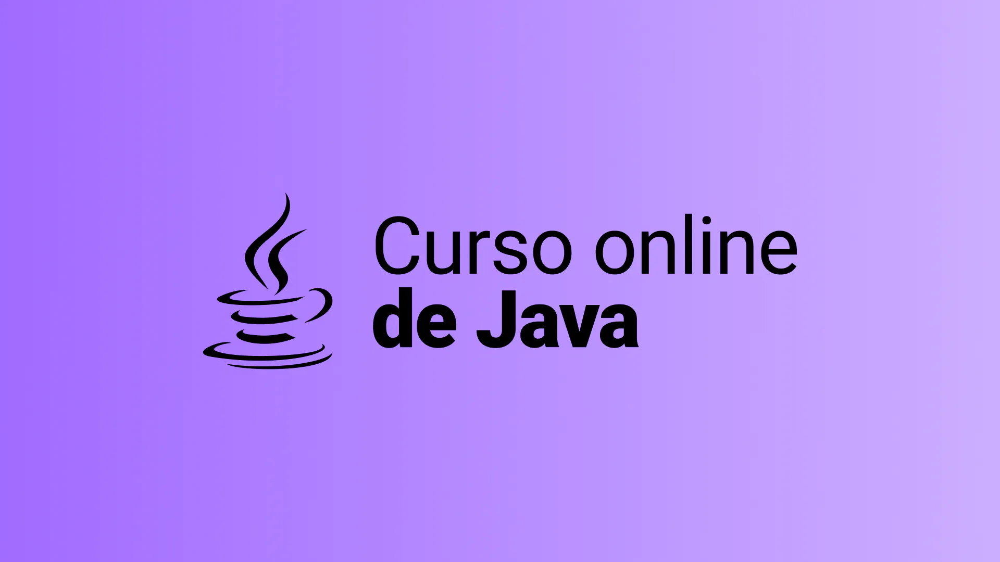

<p align="center">
  
</p>

<p align="center">
  
 
</p>

## Architecture
<details>
  <summary>Diagram Overview</summary>

  <p align="center">
    
  </p>
</details>

<details>
  <summary>Diagram Database</summary>

  <p align="center">
    
  </p>
</details>


## Tecnologias
Esse projeto foi desenvolvido com as seguintes tecnologias:

- [Java](https://www.java.com/)
- [Spring](https://spring.io/)
- [Maven](https://maven.apache.org/)
- [H2](https://www.h2database.com/html/main.html)

## Projeto
O todolist é uma api de gerenciamento de tasks que utiliza authenticação para permitir a manipulação dos dados registros nas tarefas

## Authentication
Está sendo utilizada a authenticação do tipo `Basic Auth` sendo assim todas as requisições devem informar o `username` e `password`

| Parameter | Type | Description |
| :--- | :--- | :--- |
| `username` | `string` | **Required**. API key |
| `password` | `string` | **Required**. API key |

## Como executar aplicação
- Clone o repositório
- Instale as dependencias com `mvn clean install`
- Inicie a aplicação com `mvn spring-boot:run` ou usando IDE como `Vscode, Eclipse ou Intellij`

Agora você pode acessar as APIs usando alguma ferramenta como `Postman, Insominia, ApiDog` ou qualquer outro Rest Client.

##### POST `http://localhost:8080/users/`
```http
POST /users/
{
    "name": "Someone",
    "username": "someusername",
    "password": "1234"
}
```

##### POST `http://localhost:8080/tasks/`
```http
POST /tasks/
{
    "description": "Tarefa pra gravar aula de Tasks do curso spring boot",
    "title": "Gravação de aula",
    "priority": "ALTA",
    "startAt": "2023-10-22T12:30:00",
    "endAt": "2023-10-22T15:35:00"
}
```

##### PUT `http://localhost:8080/tasks/{taskId}`
```http
PUT /tasks/{task_id}
{
    "title": "Gravação de aula update",
    "priority": "ALTA",
    "startAt": "2023-10-22T12:30:00",
    "endAt": "2023-10-22T15:35:00"
}
```
##### GET `http://localhost:8080/tasks/`
```http
GET /tasks/
```

## Como acessar h2 database
Para acessar o console h2 use a seguinte url http://localhost:8080/h2-console as configurações são feitas no arquivo `application.properties`

```
spring.datasource.url=jdbc:h2:mem:todolist
spring.datasource.driverClassName=org.h2.Driver
spring.datasource.username=admin
spring.datasource.password=admin
spring.jpa.database-platform=org.hibernate.dialect.H2Dialect
spring.h2.console.enabled=true
```

